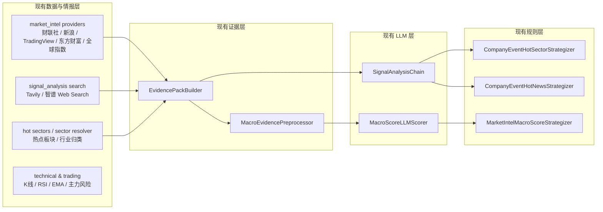
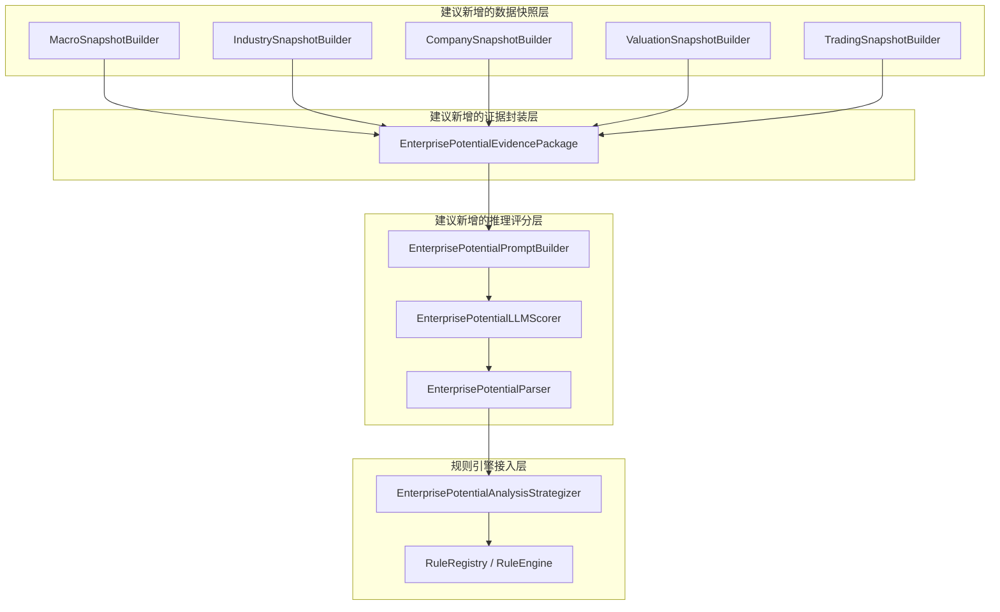

# 企业潜力分析规则设计（调研稿）

## 1. 背景

`stock_screener` 目前已经具备以下几类能力：

- 数据库驱动规则引擎：
  - `stock_screener/rule_engine.py`
  - `stock_screener/db.py`
  - `stock_screener/sql/001_screening_rules.sql`
- 宏观/市场情报抓取与缓存：
  - `stock_screener/market_intel/*`
  - `stock_screener/sql/017_market_intel.sql`
- 搜索增强与 LLM 辅助分析：
  - `stock_screener/signal_analysis/*`
  - `stock_screener/sql/002_signal_analysis.sql`
- 技术面与交易行为规则：
  - `stock_screener/strategizers.py`
  - `stock_screener/filters.py`
- 已落地的宏观评分规则：
  - `market_intel_macro_score_link`
  - `CompanyEventHotSectorStrategizer`
  - `CompanyEventHotNewsStrategizer`
  - `MarketIntelMacroScoreStrategizer`

当前系统的强项是：

- 技术筛选
- 新闻/公告/热点板块证据整合
- LLM 对证据进行结构化总结和辅助评分

当前系统的短板是：

- 缺少完整的结构化宏观因子层
- 缺少行业周期与企业质量的统一快照层
- 缺少估值模块
- 缺少把宏观、行业、企业、估值、交易五类因子统一进一个评分模型的规则实现

因此，若要新增一条名为 `企业潜力分析` 的规则，不建议直接改造现有 `market_intel_macro_score_link`，而应新增一条独立规则，在复用现有基础设施的同时，建立单独的五模块评分模型。

---

## 2. 目标

新增一条数据库驱动规则：

- `rule_key`: `enterprise_potential_analysis`
- `rule_name`: `企业潜力分析`
- `rule_type`: `strategy`
- `strategy_category`: `macro`
- `implementation`: `EnterprisePotentialAnalysisStrategizer`

该规则的目标不是简单判断一条新闻是否利好，而是构建一个：

> 基于宏观环境 + 行业景气 + 企业质量 + 估值位置 + 交易行为 + LLM 因果推理

的统一评分规则，用于回答：

- 这家公司是否值得买入
- 建议持有周期
- 风险收益比大致如何
- 主要驱动因素与主要风险是什么
- 结论的证据链和因果链是什么

---

## 3. 非目标

本方案当前不是为了：

- 替换已有 `market_intel_macro_score_link`
- 改写默认筛选链 `default_zuoyi_and_other`
- 让 AI 直接决定是否下单
- 为每个维度单独发起一次 LLM 请求
- 在没有真实结构化数据时伪造宏观或财务数字
- 将 ETF 与个股使用完全相同的企业潜力模型

---

## 4. 现有能力图谱



---

## 5. 现有可复用能力梳理

## 5.1 规则引擎与规则接入能力

代码位置：

- `stock_screener/rule_engine.py`
- `stock_screener/db.py`
- `stock_screener/sql/001_screening_rules.sql`

已具备：

- 数据库元数据驱动的原子规则定义
- JSON DSL 规则链表达式
- 规则实现白名单 `RuleRegistry`
- `Strategizer` 接口
- `FilterContext` 缓存注入机制
- 单股执行与输出详情回写

这意味着：

- 新增 `enterprise_potential_analysis` 在规则框架层面是可行的
- 主要工作不在 DSL，而在数据层、快照层、评分层、缓存层

---

## 5.2 市场情报与证据整合能力

代码位置：

- `stock_screener/market_intel/providers/source_registry.py`
- `stock_screener/market_intel/service.py`
- `stock_screener/market_intel/evidence.py`
- `stock_screener/sql/017_market_intel.sql`

已具备数据源：

- 财联社：市场快讯
- 新浪财经：市场新闻
- TradingView：新闻流
- 东方财富：公告、研报、财务摘要
- 全球指数：指数快照

已具备能力：

- provider 抽象
- 单股与市场级 bundle
- provider 执行状态记录
- 数据去重
- stale/fresh 状态
- `EvidencePackBuilder` 统一生成 LLM 证据包

适合复用的点：

- 市场级上下文
- 公司级事件/公告/研报
- provider 运行状态
- `data_gaps`
- `citations`

---

## 5.3 搜索与 LLM 分析能力

代码位置：

- `stock_screener/signal_analysis/service.py`
- `stock_screener/signal_analysis/llm_providers.py`
- `stock_screener/signal_analysis/search_providers.py`
- `stock_screener/signal_analysis/chain.py`
- `stock_screener/sql/002_signal_analysis.sql`

已具备：

- Tavily / 智谱搜索
- fallback provider
- LLM fallback provider
- JSON 输出约束
- 分市场批量分析
- 分股票缓存
- 搜索上下文截断与批量处理

适合复用的点：

- 批量公司新闻搜索
- 市场热点新闻搜索
- LLM `complete_json()` 能力
- 结果缓存机制
- 配额敏感的 batch-first 设计

---

## 5.4 行业与板块能力

代码位置：

- `stock_screener/signal_analysis/hot_sectors.py`
- `stock_screener/sector_resolver.py`

已具备：

- A 股热点板块识别
- 多源行业/板块回填
- 搜索 + 行业归类兜底

适合复用的点：

- 行业归属
- 热点板块标签
- 行业上下文增强

当前不足：

- 缺少统一的行业周期快照
- 缺少行业增速/库存周期/Capex 周期等结构化字段

---

## 5.5 企业与交易能力

企业侧：

- 东方财富财务摘要
- 公告
- 研报
- 公司新闻搜索

交易侧：

- `strategizers.py` 中技术规则
- K 线
- 主力风险分析

适合复用的点：

- 交易行为模块的基础数据
- 企业事件与公司新闻
- PE、市值等基础估值字段

当前不足：

- 企业质量字段未统一结构化
- 估值字段覆盖不足
- 护城河和经营质量更多依赖 LLM 文本推断，缺少结构化财务因子层

---

## 6. 当前能力对目标模型的覆盖度

目标模型：

```text
宏观环境 -> 行业景气 -> 企业质量 -> 估值变化 -> 市场资金行为 -> 股票收益率
```

目标评分公式：

```text
TotalScore = 0.30M + 0.25I + 0.25C + 0.10V + 0.10T
```

覆盖度评估如下：

| 模块 | 目标内容 | 当前覆盖情况 | 判断 |
| --- | --- | --- | --- |
| Macro | 利率、CPI、PMI、失业率、M2、信用、收益率曲线、DXY、VIX | 主要是新闻、快讯、指数快照，缺少结构化宏观指标 | 缺口大 |
| Industry | 行业增速、库存周期、政策支持、Capex、竞争格局、全球需求 | 有热点板块和行业归类，但缺行业周期快照 | 部分覆盖 |
| Company | ROIC、毛利率、FCF、负债、收入增速、护城河 | 有公告/研报/财务摘要/新闻，但字段不统一 | 部分覆盖 |
| Valuation | PE、PEG、PB、EV/EBITDA、DCF 偏离 | 目前主要有 PE 与市值 | 缺口大 |
| Trading | 趋势、成交量、波动、机构/主力流向、相对强弱 | 技术规则和主力风险已有较强基础 | 覆盖较好 |

结论：

- 当前系统最接近的是“事件/新闻共振分析”
- 距离“企业潜力分析量化模型”还缺三个关键层：
  - 结构化宏观因子层
  - 结构化行业/企业快照层
  - 估值快照层

---

## 7. 选型结论

### 7.1 不建议直接扩展现有 `market_intel_macro_score_link`

原因：

1. 现有规则语义是“宏观/事件共振评分”
2. 现有输入更偏新闻、公告、热点板块
3. 新规则需要完整的五模块评分，不应混入旧规则语义
4. 后续若继续迭代，两个规则分开维护更清晰

因此建议：

- 保留现有：
  - `company_event_hot_sector_link`
  - `company_event_hot_news_link`
  - `market_intel_macro_score_link`
- 新增独立规则：
  - `enterprise_potential_analysis`

---

## 8. 建议的新规则总体架构



建议新增模块目录：

```text
stock_screener/potential_analysis/
  models.py
  builders.py
  prompting.py
  scorer.py
  parser.py
  service.py
```

说明：

- `market_intel` 继续负责通用情报采集
- `signal_analysis` 继续负责搜索和 LLM 基础设施
- `potential_analysis` 负责企业潜力分析领域对象与评分逻辑
- 规则引擎只负责接入，不承载复杂领域逻辑

---

## 9. 评分模型设计

## 9.1 总分公式

```text
TotalScore = 0.30M + 0.25I + 0.25C + 0.10V + 0.10T
```

其中：

- `M` = Macro 宏观环境
- `I` = Industry 行业景气
- `C` = Company 企业质量
- `V` = Valuation 估值
- `T` = Trading 市场行为

每一项评分范围建议为：

- `0 ~ 100`

最终输出：

- `0 ~ 100`

规则阈值建议：

- 默认 `threshold = 70`

判定语义建议：

- `>= 70`：`pass`
- `< 70`：`fail`
- 数据严重不足：`skip`
- 评分执行失败：`error`

---

## 9.2 各模块定义

### Macro 宏观环境

目标判断：

- 当前宏观环境是否支持该类资产上涨

建议输入：

- 利率水平
- 利率趋势
- CPI / 核心 CPI
- PMI
- 失业率
- M2 增速
- 信贷增速
- 收益率曲线
- DXY
- VIX

当前可临时代理的数据：

- 市场快讯
- 政策/宏观新闻搜索
- 全球指数快照

### Industry 行业景气

目标判断：

- 行业是否处于景气上升周期

建议输入：

- 行业增速
- 库存周期
- 政策支持
- Capex 周期
- 技术周期
- 竞争格局
- 全球需求

当前可临时代理的数据：

- 热点板块
- 行业归类
- 行业相关新闻

### Company 企业质量

目标判断：

- 企业是否具备长期竞争优势与增长质量

建议输入：

- ROIC
- 毛利率
- 自由现金流
- 负债率
- 净利润率
- 收入增速
- 新产品收入
- 护城河标签

当前可临时代理的数据：

- 财务摘要
- 公告
- 研报
- 公司新闻
- LLM 对护城河/竞争力的文本判断

### Valuation 估值

目标判断：

- 当前价格是否合理

建议输入：

- PE
- PEG
- PB
- EV/EBITDA
- DCF 偏离
- 同业估值分位

当前可直接使用的数据：

- PE
- 市值

### Trading 市场行为

目标判断：

- 资金行为和市场情绪是否支持交易落地

建议输入：

- 趋势强度
- 成交量确认
- 波动率风险
- 主力/机构资金方向
- 相对强弱

当前可直接使用的数据：

- K 线
- 技术策略结果
- 主力风险分析

---

## 10. 建议的证据包结构

建议由 `EnterprisePotentialEvidencePackage` 统一承接五个模块输入：

```json
{
  "market": "US",
  "code": "NVDA",
  "as_of": "2026-05-28T14:00:00Z",
  "macro_snapshot": {
    "interest_rate": {"current": 5.25, "trend": "falling"},
    "inflation": {"cpi": 3.1, "trend": "declining"},
    "economic_cycle": {"pmi": 52, "stage": "early_recovery"}
  },
  "industry_snapshot": {
    "industry": "Semiconductor",
    "growth_rate": 18,
    "inventory_cycle": "destocking_end",
    "policy_support": "strong"
  },
  "company_snapshot": {
    "roic": 24,
    "gross_margin": 67,
    "free_cash_flow": "positive_5y",
    "debt_ratio": "low",
    "moat": ["brand", "ecosystem", "switching_cost"]
  },
  "valuation_snapshot": {
    "pe": 28,
    "peg": 1.4,
    "pb": 5.6,
    "valuation_percentile": 72
  },
  "trading_snapshot": {
    "trend_strength": 74,
    "volume_confirmation": 68,
    "volatility_risk": 41,
    "institutional_flow": "positive"
  },
  "evidence_refs": [],
  "data_gaps": []
}
```

说明：

- 该结构不是当前仓库已有结构
- 这是建议新增的统一领域对象
- 当前已有 `EvidencePack` 更偏“新闻/情报证据包”，不足以直接承载五模块评分

---

## 11. 建议的 LLM 输出结构

```json
{
  "ticker": "NVDA",
  "total_score": 87,
  "macro_score": 82,
  "industry_score": 90,
  "company_score": 94,
  "valuation_score": 61,
  "trading_score": 78,
  "holding_period": "6-18 months",
  "confidence_score": 81,
  "expected_return_profile": "High Growth",
  "decision": "BUY",
  "main_drivers": [
    "AI infrastructure expansion",
    "Falling interest rates",
    "Strong pricing power"
  ],
  "main_risks": [
    "Overvaluation",
    "Export regulation"
  ],
  "causal_chain": [
    "降息",
    "流动性改善",
    "AI Capex 上升",
    "需求提升",
    "盈利预期改善"
  ],
  "evidence_refs": [],
  "data_gaps": []
}
```

补充建议：

- 输出必须为 JSON object
- 每个模块分数与总分都限制在 `0~100`
- `confidence_score` 与 `data_gaps` 需要同时存在，避免高分掩盖证据不足
- `causal_chain` 体现 LLM 的因果推理价值

---

## 12. 与现有规则引擎的接入方式

接入点如下：

### 12.1 元数据与 SQL

需要同步修改：

- `stock_screener/db.py`
- `stock_screener/sql/001_screening_rules.sql` 或新增独立 migration

建议元数据：

```json
{
  "rule_key": "enterprise_potential_analysis",
  "rule_name": "企业潜力分析",
  "rule_type": "strategy",
  "strategy_category": "macro",
  "implementation": "EnterprisePotentialAnalysisStrategizer",
  "params_json": {
    "threshold": 70,
    "refresh_policy": "cache_or_refresh",
    "analysis_mode": "batch_prefetch",
    "weights": {
      "macro": 0.30,
      "industry": 0.25,
      "company": 0.25,
      "valuation": 0.10,
      "trading": 0.10
    },
    "min_confidence": 50,
    "rule_version": "v1"
  }
}
```

### 12.2 规则实现注册

需要接入：

- `RuleRegistry.default()`
- `RuleEngine.requires_*()` 依赖探测

### 12.3 运行时上下文注入

需要接入：

- `stock_screener/api/screen_service.py`
- `stock_screener/web/single_stock.py`

需要新增缓存约定，例如：

- `enterprise_potential_service`
- `enterprise_potential_scorer`
- `enterprise_potential:{code}`

### 12.4 宏观结构化因子持久化表结构建议

本节补充“宏观结构化因子”的 MySQL 持久化设计。这里的命名尽量对齐当前仓库已有表结构风格：

- `*_metadata`
- `*_values`
- `*_bundles`
- `*_provider_runs`
- `*_cache`

重点参考的现有表：

- `market_intel_items`
- `market_intel_bundles`
- `market_intel_provider_runs`
- `signal_analysis_cache`
- `screening_rule_metadata`

#### 12.4.1 `macro_factor_metadata`

用途：

- 定义宏观因子字典
- 描述因子频率、类型、展示顺序和扩展参数
- 供快照构建器和前端共用

建议表结构：

```sql
CREATE TABLE IF NOT EXISTS macro_factor_metadata (
    id BIGINT UNSIGNED NOT NULL AUTO_INCREMENT,
    factor_key VARCHAR(64) NOT NULL COMMENT '因子键，如 policy_rate / cpi_yoy / vix',
    factor_name VARCHAR(128) NOT NULL COMMENT '因子名称',
    factor_category VARCHAR(32) NOT NULL COMMENT 'rate/inflation/growth/employment/liquidity/fx/volatility/policy',
    value_type VARCHAR(16) NOT NULL COMMENT 'number/text/json',
    unit VARCHAR(32) NULL COMMENT '%, bp, index 等',
    frequency VARCHAR(16) NOT NULL COMMENT 'daily/weekly/monthly/quarterly/event',
    enabled TINYINT(1) NOT NULL DEFAULT 1 COMMENT '是否启用',
    display_order INT NOT NULL DEFAULT 100 COMMENT '展示顺序',
    params_json JSON NULL COMMENT '扩展参数，如 TTL、缺失策略、口径说明',
    description VARCHAR(512) NULL,
    created_at DATETIME(6) NOT NULL DEFAULT CURRENT_TIMESTAMP(6),
    updated_at DATETIME(6) NOT NULL DEFAULT CURRENT_TIMESTAMP(6) ON UPDATE CURRENT_TIMESTAMP(6),
    PRIMARY KEY (id),
    UNIQUE KEY uk_macro_factor_metadata_key (factor_key),
    KEY idx_macro_factor_metadata_category (factor_category, enabled)
) ENGINE=InnoDB DEFAULT CHARSET=utf8mb4 COMMENT='宏观因子元数据';
```

字段命名对齐点：

- 参考 `screening_rule_metadata` 的 `*_key`、`enabled`、`display_order`、`params_json`
- 不额外引入过于数仓化的 `dimension_table` 风格命名

#### 12.4.2 `macro_factor_values`

用途：

- 存放宏观因子的持久化取值明细
- 支持不同频率
- 支持数值、枚举、JSON 类型
- 支持“先查库，再决定是否回源”

建议表结构：

```sql
CREATE TABLE IF NOT EXISTS macro_factor_values (
    id BIGINT UNSIGNED NOT NULL AUTO_INCREMENT,
    scope_type VARCHAR(16) NOT NULL COMMENT 'market/global',
    market VARCHAR(8) NOT NULL COMMENT 'A/HK/US/GLOBAL',
    code VARCHAR(32) NOT NULL DEFAULT '' COMMENT '宏观因子通常为空字符串，保留以对齐现有 items/bundles 表结构',
    source VARCHAR(64) NOT NULL COMMENT '来源展示名',
    provider VARCHAR(64) NOT NULL COMMENT 'provider key',
    factor_key VARCHAR(64) NOT NULL COMMENT '对应 macro_factor_metadata.factor_key',
    item_type VARCHAR(32) NOT NULL DEFAULT 'macro_factor' COMMENT '固定 macro_factor，便于与现有 item_type 语义对齐',
    value DECIMAL(20,8) NULL COMMENT '数值型因子值',
    value_text VARCHAR(128) NULL COMMENT '文本型因子值',
    value_json JSON NULL COMMENT '结构化因子值',
    unit VARCHAR(32) NULL COMMENT '本条取值单位，允许覆盖 metadata.unit',
    period_type VARCHAR(16) NOT NULL COMMENT 'day/week/month/quarter/event',
    period_start DATE NULL,
    period_end DATE NULL,
    event_time DATETIME(6) NULL COMMENT '统计期或事件发生时间',
    published_at DATETIME(6) NULL COMMENT '数据发布时间',
    fetched_at DATETIME(6) NOT NULL COMMENT '抓取时间',
    effective_at DATETIME(6) NULL COMMENT '可被策略安全使用的生效时间',
    expires_at DATETIME(6) NULL COMMENT '缓存过期时间',
    value_status VARCHAR(16) NOT NULL DEFAULT 'confirmed' COMMENT 'confirmed/estimated/revised/manual',
    is_stale TINYINT(1) NOT NULL DEFAULT 0,
    dedupe_key VARCHAR(255) NOT NULL COMMENT '同一 factor_key 在同一 provider 下的去重键',
    raw_json JSON NULL COMMENT '原始响应',
    created_at DATETIME(6) NOT NULL DEFAULT CURRENT_TIMESTAMP(6),
    updated_at DATETIME(6) NOT NULL DEFAULT CURRENT_TIMESTAMP(6) ON UPDATE CURRENT_TIMESTAMP(6),
    PRIMARY KEY (id),
    UNIQUE KEY uk_macro_factor_value_dedupe (
        scope_type, market, code, provider, factor_key, dedupe_key
    ),
    KEY idx_macro_factor_value_scope (scope_type, market, code, factor_key),
    KEY idx_macro_factor_value_published (factor_key, published_at),
    KEY idx_macro_factor_value_effective (factor_key, effective_at),
    KEY idx_macro_factor_value_expires (expires_at)
) ENGINE=InnoDB DEFAULT CHARSET=utf8mb4 COMMENT='宏观因子取值明细';
```

字段命名对齐点：

- 参考 `market_intel_items`：
  - `scope_type`
  - `market`
  - `code`
  - `source`
  - `provider`
  - `item_type`
  - `event_time`
  - `published_at`
  - `fetched_at`
  - `expires_at`
  - `is_stale`
  - `dedupe_key`
  - `raw_json`
- 这里没有新增单独的 `cache_key` 列，因为项目现有明细表通常通过“自然唯一键 + dedupe_key”做持久化去重

#### 12.4.3 `macro_factor_bundles`

用途：

- 存放某个市场、某个交易日、某个分析画像下的宏观因子聚合包
- 直接给规则引擎、LLM 和前端使用
- 语义上对应当前的 `market_intel_bundles`

建议表结构：

```sql
CREATE TABLE IF NOT EXISTS macro_factor_bundles (
    id BIGINT UNSIGNED NOT NULL AUTO_INCREMENT,
    scope_type VARCHAR(16) NOT NULL COMMENT 'market/global',
    market VARCHAR(8) NOT NULL,
    code VARCHAR(32) NOT NULL DEFAULT '',
    trade_date DATE NOT NULL COMMENT '交易日',
    analysis_profile VARCHAR(32) NOT NULL DEFAULT 'default' COMMENT 'default/enterprise_potential_v1 等',
    bundle_json JSON NOT NULL COMMENT '拼好的宏观因子聚合包',
    freshness_status VARCHAR(16) NOT NULL COMMENT 'fresh/partial/stale/empty',
    source_status_json JSON NULL COMMENT '各 provider 状态',
    data_gaps JSON NULL COMMENT '缺失因子与缺失来源',
    created_at DATETIME(6) NOT NULL DEFAULT CURRENT_TIMESTAMP(6),
    updated_at DATETIME(6) NOT NULL DEFAULT CURRENT_TIMESTAMP(6) ON UPDATE CURRENT_TIMESTAMP(6),
    PRIMARY KEY (id),
    UNIQUE KEY uk_macro_factor_bundle_scope (
        scope_type, market, code, analysis_profile, trade_date
    ),
    KEY idx_macro_factor_bundle_status (freshness_status),
    KEY idx_macro_factor_bundle_trade_date (market, trade_date)
) ENGINE=InnoDB DEFAULT CHARSET=utf8mb4 COMMENT='宏观因子聚合包';
```

字段命名对齐点：

- 参考 `market_intel_bundles` 的：
  - `bundle_json`
  - `freshness_status`
  - `source_status_json`
- 参考 `signal_analysis_cache` 的：
  - `analysis_profile`
  - `trade_date`

#### 12.4.4 `macro_factor_provider_runs`

用途：

- 记录每次宏观因子 provider 的执行情况
- 对齐现有 `market_intel_provider_runs`
- 便于排查“为何命中不到因子值，是否 provider 拉取失败”

建议表结构：

```sql
CREATE TABLE IF NOT EXISTS macro_factor_provider_runs (
    id BIGINT UNSIGNED NOT NULL AUTO_INCREMENT,
    provider VARCHAR(64) NOT NULL,
    scope_type VARCHAR(16) NOT NULL,
    market VARCHAR(8) NOT NULL,
    code VARCHAR(32) NOT NULL DEFAULT '',
    status VARCHAR(16) NOT NULL COMMENT 'success/failed/timeout/skipped',
    error_message TEXT NULL,
    duration_ms INT NOT NULL DEFAULT 0,
    item_count INT NOT NULL DEFAULT 0 COMMENT '本次写入的因子条数',
    raw_json JSON NULL,
    started_at DATETIME(6) NOT NULL,
    finished_at DATETIME(6) NOT NULL,
    created_at DATETIME(6) NOT NULL DEFAULT CURRENT_TIMESTAMP(6),
    PRIMARY KEY (id),
    KEY idx_macro_factor_runs_scope (provider, scope_type, market, code),
    KEY idx_macro_factor_runs_status (status),
    KEY idx_macro_factor_runs_started (started_at)
) ENGINE=InnoDB DEFAULT CHARSET=utf8mb4 COMMENT='宏观因子 provider 执行记录';
```

#### 12.4.5 可选的 `macro_factor_analysis_cache`

如果后续宏观因子本身还要产出一层“分析结果缓存”，例如：

- 宏观评分
- 风险偏好标签
- LLM 摘要

则建议新增：

- `macro_factor_analysis_cache`

其命名应对齐：

- `signal_analysis_cache`
- `option_macro_analysis_cache`

但这张表不是“宏观结构化因子持久化”的最小必需项，当前阶段可以只先设计，不一定立刻实现。

### 12.5 持久化优先读取策略与 cacheKey 设计

本节明确回答：

> 如果表里面已经有数据，就不用再从数据源取；如果没有，才从数据源里面取。  
> 在这种模式下，不同宏观因子的 cacheKey 怎么设计？

#### 12.5.1 读取策略：先查库，缺失再回源

建议规则如下：

1. 先按 `analysis_profile + trade_date + market` 查询 `macro_factor_bundles`
2. 若存在 bundle，且：
   - `freshness_status in ('fresh', 'partial')`
   - `bundle_json` 中包含规则要求的必要因子
   - 组成该 bundle 的关键因子在 `macro_factor_values` 中未过期
   则直接使用 bundle，不访问外部 provider
3. 如果 bundle 不存在、为空、过期，或者关键因子缺失：
   - 再按因子粒度查询 `macro_factor_values`
4. 对仍然缺失或已过期的因子，才触发对应 provider 拉取
5. 拉取成功后：
   - `upsert macro_factor_values`
   - 重建并 `upsert macro_factor_bundles`
6. 同一轮执行中，优先复用已经构建好的 bundle，不重复访问数据源

推荐执行顺序：

```text
load bundle from DB
-> if usable: return
-> else load factor values from DB
-> detect missing / expired factors
-> fetch only missing factors from provider
-> upsert macro_factor_values
-> rebuild macro_factor_bundles
-> return bundle
```

#### 12.5.2 因子值层不建议单独增加 `cache_key` 字段

对齐当前项目风格，建议：

- `macro_factor_values` 不单独增加 `cache_key`
- 使用：
  - 自然唯一键
  - `dedupe_key`

做持久化身份

原因：

1. 当前仓库的明细数据表，例如 `market_intel_items`，本来就是这种设计
2. 因子值是“事实明细”，更适合自然键去重，不必再人为塞一个长 `cache_key`
3. `cache_key` 更适合分析结果缓存表，而不是底层事实表

也就是说，对 `macro_factor_values` 来说，真正的持久化 cache identity 是：

```text
(scope_type, market, code, provider, factor_key, dedupe_key)
```

而不是一列单独的 `cache_key`

#### 12.5.3 不同宏观因子的 `dedupe_key` 设计

由于唯一键已经包含：

- `scope_type`
- `market`
- `code`
- `provider`
- `factor_key`

因此 `dedupe_key` 本身不需要重复把这些字段再拼进去。  
`dedupe_key` 只需要表达“同一个因子在该 provider 下的具体一期数据身份”。

建议按频率设计：

##### 日频因子

例如：

- `policy_rate`
- `dxy`
- `vix`
- `yield_curve_10y_2y`

建议：

```text
day:2026-05-28
```

如果同一天同一 provider 可能多次发布修订版，则可以加发布时间：

```text
day:2026-05-28:2026-05-28T21:30:00
```

##### 月频因子

例如：

- `cpi_yoy`
- `core_cpi_yoy`
- `m2_yoy`
- `unemployment_rate`
- `manufacturing_pmi`

建议：

```text
month:2026-05-01
```

如需区分同一期修订版：

```text
month:2026-05-01:2026-06-12T08:30:00
```

##### 季频因子

例如：

- `gdp_yoy`

建议：

```text
quarter:2026Q1
```

或：

```text
quarter:2026-01-01:2026-03-31
```

##### 事件型因子

例如：

- `policy_stance`
- `macro_risk_event`

建议：

```text
event:2026-06-13T02:00:00:fomc
```

或：

```text
event:2026-06-policy-meeting
```

结论：

- 不同宏观因子的“cache key”本质上不是统一一个模板强拼所有字段
- 而是：
  - 因子值层：自然唯一键 + 因子频率对应的 `dedupe_key`
  - 聚合包层：自然唯一键
  - 分析结果层：单独 `cache_key`

#### 12.5.4 聚合包层的身份设计

`macro_factor_bundles` 建议不单独增加 `cache_key` 列，对齐 `market_intel_bundles`。

它的持久化身份建议直接用唯一键：

```text
(scope_type, market, code, analysis_profile, trade_date)
```

如果在 Python 内存缓存或后续 Redis 中需要构造字符串 key，可使用：

```text
macro_factor_bundle:{scope_type}:{market}:{code_or_empty}:{analysis_profile}:{trade_date}
```

例如：

```text
macro_factor_bundle:market:US::enterprise_potential_v1:2026-05-28
```

这里数据库和内存缓存可以分开：

- 数据库：用自然唯一键
- 内存缓存：用字符串 key

#### 12.5.5 分析结果层的 `cache_key` 设计

如果后续落地 `macro_factor_analysis_cache`，则建议显式使用 `cache_key`，并对齐现有：

- `signal_analysis_cache.cache_key`
- `option_macro_analysis_cache.cache_key`

建议模板：

```text
{market}:{code_or_empty}:{trade_date}:{analysis_profile}:{rule_version}:{model}:{bundle_digest}
```

例如：

```text
US::2026-05-28:enterprise_potential_v1:v1:gpt-5.4:ab12cd34...
```

其中：

- `market`：市场
- `code_or_empty`：宏观通常为空字符串；若未来支持行业/股票级宏观分析，可填 code
- `trade_date`：交易日
- `analysis_profile`：例如 `enterprise_potential_v1`
- `rule_version`：规则版本
- `model`：模型名
- `bundle_digest`：`bundle_json` 的摘要

这样可以保证：

- 同一天同市场
- 但不同规则版本 / 不同模型 / 不同输入 bundle

不会互相误命中

#### 12.5.6 为什么这里要区分 `dedupe_key` 和 `cache_key`

建议遵守以下语义边界：

- `dedupe_key`
  - 用于“事实明细”的唯一身份
  - 主要服务于 `macro_factor_values`
  - 对齐 `market_intel_items`
- `cache_key`
  - 用于“分析结果缓存”的命中身份
  - 主要服务于 `*_analysis_cache`
  - 对齐 `signal_analysis_cache` 和 `option_macro_analysis_cache`

这样设计后，整套命名和职责边界会与当前项目保持一致，不会引入一套完全新的持久化语义。

---

## 13. 执行策略建议

不建议单股逐条联网执行。

建议采用 batch-first：


原因：

- 宏观数据通常是市场级共享，不应每只股票重复抓取
- 行业数据应按行业去重，不应按股票重复抓取
- 公司新闻搜索已有批量能力，应继续沿用
- LLM 调用若按单股执行，成本和时延都偏高

---

## 14. 配额估算（100 只股票 / 单市场）

在 batch-first 前提下，建议估算如下：

| 资源 | 估算调用量 | 说明 |
| --- | ---: | --- |
| K 线 | 0 次新增 | 复用现有筛选流程结果 |
| 宏观数据 API | 1~3 次 | 市场级快照 |
| 行业数据 / 搜索 | 约 12 次 | 假设 100 只股票分布在 12 个行业 |
| 公司新闻搜索 | 约 10 次 | 每批 10 只股票 |
| LLM | 约 5 次 | 每批 20 只股票 |

不建议的逐股实现：

| 资源 | 估算调用量 |
| --- | ---: |
| 公司新闻搜索 | 100+ |
| LLM | 100 |

结论：

- 若没有批量化预取与评分，规则虽能实现，但不适合作为正式规则链能力

---

## 15. 缺少的基础设施与待调研清单

以下是本方案当前明确缺少、需要先调研再决定怎么做的基础设施。

## 15.1 宏观结构化因子基础设施

现状：

- 当前只有市场新闻、政策新闻、指数快照
- 没有标准化宏观指标快照

缺口：

- 利率
- 利率趋势
- CPI / 核心 CPI
- PMI
- 失业率
- M2
- 信贷增速
- 收益率曲线
- DXY
- VIX

待调研问题：

- 数据源选哪家
- 各市场口径是否统一
- 更新频率如何控制
- `macro_factor_values` 与 `macro_factor_bundles` 的刷新策略如何按不同频率落地
- `effective_at` 是否要在所有 provider 中强制补齐

---

## 15.2 行业周期快照基础设施

现状：

- 有行业归类
- 有热点板块
- 没有行业周期快照

缺口：

- 行业增速
- 库存周期
- Capex 周期
- 竞争格局
- 全球需求
- 政策支持强度

待调研问题：

- 用结构化 API 还是搜索 + LLM 抽取
- 行业维度如何跨 A/HK/US 对齐
- 是否要维护行业字典与同义词映射

---

## 15.3 企业质量快照基础设施

现状：

- 有财务摘要、公告、研报、新闻
- 但未统一成企业质量快照

缺口：

- ROIC
- 毛利率
- 自由现金流
- 净利润率
- 负债率
- 收入增速
- 创新与新产品收入
- 护城河标签

待调研问题：

- 财务指标来源是否足够稳定
- 多市场财务字段能否统一
- 护城河是否只靠 LLM 判断，还是要引入结构化标签来源

---

## 15.4 估值快照基础设施

现状：

- 规则侧主要有 PE、市值
- 设计目标中的估值体系尚未存在

缺口：

- PEG
- PB
- EV/EBITDA
- DCF 偏离
- 估值分位
- 同业可比

待调研问题：

- 估值数据源是否可覆盖 A/HK/US
- forward PE 与 trailing PE 口径如何处理
- 是否需要单独的 valuation cache 表

---

## 15.5 统一五模块快照对象基础设施

现状：

- 现有 `EvidencePack` 偏新闻/事件证据
- 现有 `SignalAnalysisResult` 偏信号可靠性
- 现有 `MacroScoreResult` 偏宏观共振

缺口：

- `EnterprisePotentialEvidencePackage`
- `MacroSnapshotBuilder`
- `IndustrySnapshotBuilder`
- `CompanySnapshotBuilder`
- `ValuationSnapshotBuilder`
- `TradingSnapshotBuilder`

待调研问题：

- 快照对象是否独立模块维护
- 是否复用 `market_intel` 存储结构
- 不同模块缺失时如何降级

---

## 15.6 批量预取与批量评分编排基础设施

现状：

- `signal_analysis` 已有 batch 设计
- 但规则引擎按单股执行

缺口：

- 面向规则链的预取入口
- 行业去重预取
- 批量 company search
- 批量 LLM 评分后按 code 回填

待调研问题：

- 放在 `screen_service.py` 还是独立 service
- 与现有 `run_signal_analysis_for_market()` 如何解耦
- 单股分析与批量筛选是否共用同一缓存

---

## 15.7 企业潜力分析缓存与持久化基础设施

现状：

- 有 `signal_analysis_cache`
- 有 `screening_signal_analysis`
- 有 `market_intel_*`

缺口：

- 企业潜力分析专用 analysis cache 是否独立落表尚未定

可选方向：

1. 复用现有 `signal_analysis_cache`
2. 新增 `enterprise_potential_analysis_cache`
3. 新增 `macro_factor_analysis_cache`
4. 只写入 `screening_results.filter_details`

待调研问题：

- 是否需要按 `bundle_digest + rule_version + model` 缓存
- 是否需要保留完整模块评分 JSON
- 缓存失效策略如何定义

---

## 15.8 前端展示基础设施

现状：

- 宏观评分已有一定展示逻辑
- 企业潜力分析视图尚不存在

缺口：

- 五模块评分展示
- 持有周期展示
- 决策结论展示
- 因果链展示
- 数据缺失/低置信度提示

待调研问题：

- 是沿用现有 macro block，还是做独立 detail block
- 结果列表是否要展示总分排序

---

## 15.9 ETF 语义与产品边界基础设施

现状：

- `signal_analysis` 已区分股票与 ETF
- 企业潜力分析天然偏公司视角

缺口：

- ETF 在该规则中的处理语义尚未定义

待调研问题：

- ETF 默认 `skip` 是否符合业务预期
- 是否后续扩展 ETF 版潜力模型

---

## 15.10 测试与回归样本基础设施

现状：

- 现有宏观评分与规则引擎已有测试框架

缺口：

- 五模块模拟输入样本
- 多市场快照样本
- 规则 pass/fail/skip/error 样本
- 批量评分回归样本

待调研问题：

- 是否需要固定的一组股票与预期输出
- 是否构建脱离外网的 snapshot fixture

---

## 16. 建议的调研优先级

建议按以下顺序调研：

1. 宏观结构化因子数据源
2. 估值数据源
3. 行业周期快照数据源
4. 企业质量财务字段统一口径
5. 缓存与持久化方案
6. 批量预取编排方案
7. 前端展示方式

原因：

- 前四项决定模型是否能“像你想要的 V1”
- 后三项决定它能否在现有工程里稳定运行

---

## 17. 当前建议结论

基于仓库现状，建议的总体结论是：

1. **新增独立规则**，不要复用或改名现有 `market_intel_macro_score_link`
2. **优先复用现有 market_intel / signal_analysis / rule_engine 基础设施**
3. **在实现前先补足结构化数据层设计**
4. **必须采用 batch-first 思路，而不是逐股同步评分**
5. **在缺失基础设施调研完成前，不建议把该规则接入默认链**

---

## 18. 本文档与现有设计文档的关系

相关参考设计：

- `docs/superpowers/specs/2026-05-25-market-intel-design.md`
- `docs/superpowers/specs/2026-05-26-market-intel-macro-scoring-rule-design.md`

关系说明：

- `market-intel-design` 解决的是通用市场情报层
- `market-intel-macro-scoring-rule-design` 解决的是“宏观共振评分规则”
- 本文档解决的是“企业潜力分析规则”的独立设计与缺口梳理

本文档的定位是：

- 先整理现状
- 明确复用边界
- 明确缺失基础设施
- 为后续调研和正式实现提供范围约束
