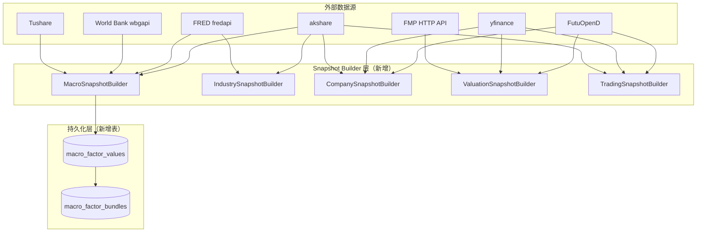

# 企业潜力分析数据源可行性调研

> 对应调研稿：`2026-05-28-enterprise-potential-analysis-rule-design.md` 第 15 节待调研清单
>
> 调研日期：2026-06-01

---

## 1. 调研目标

验证 FutuOpenD、yfinance、akshare 三个项目中已使用的数据源能否满足五模块（宏观/行业/企业质量/估值/交易）的结构化数据需求。对不满足的部分，调研替代数据源及接入方案。

---

## 2. 三个目标数据源的全局定位

| 维度 | FutuOpenD | yfinance | akshare |
|------|-----------|----------|---------|
| **项目内角色** | 核心行情+交易+股票池数据源（19+文件引用） | K线/期权/行业 fallback（5处引用） | K线/A股 fallback（10+处引用） |
| **接入方式** | 本地 daemon TCP 长连接（`futu-api` SDK） | HTTP 抓取（`yfinance` PyPI 包） | HTTP 抓取（`akshare` PyPI 包） |
| **无需 API Key** | ✅ | ✅ | ✅ |
| **A股覆盖** | ✅（行情+K线+板块） | ⚠️ 弱 | ✅ 最强 |
| **港股覆盖** | ✅ 最强（行情+K线+板块+财务筛选） | ⚠️ 部分 | ⚠️ 部分 |
| **美股覆盖** | ✅（行情+K线+财务筛选） | ✅ 最强 | ❌ |
| **宏观数据** | ❌ 不支持 | ⚠️ 极弱 | ✅ 中国最强 |
| **财务基本面** | ✅ 条件选股接口 | ✅ 三表+.info | ✅ A股财务 |
| **实时行情** | ✅ 原生支持 | ⚠️ 延迟 | ⚠️ 延迟 |
| **稳定性** | ⭐⭐⭐⭐⭐（本地 daemon） | ⭐⭐⭐（非官方抓取） | ⭐⭐⭐（网页抓取） |

---

## 3. 五模块逐模块覆盖分析

### 3.1 宏观环境 (Macro) — 权重 30%

#### 需求清单

| 因子 | 优先级 | 覆盖难度 |
|------|--------|---------|
| 利率水平 / 趋势 | 高 | 中 |
| CPI / 核心 CPI | 高 | 中 |
| PMI | 高 | 低 |
| 失业率 | 中 | 低 |
| M2 增速 | 中 | 低 |
| 信贷增速 | 中 | 中 |
| 收益率曲线 (10Y-2Y) | 中 | 低 |
| DXY 美元指数 | 中 | 低 |
| VIX 恐慌指数 | 中 | 低 |

#### 结论：FutuOpenD 完全不支持宏观数据，akshare 可完美覆盖 A 股宏观，但港股/美股宏观需要新增 FRED + World Bank

**FutuOpenD**：完全不支持宏观数据。其核心定位是行情+交易，API 文档中没有利率、CPI、PMI 等任何宏观经济指标接口。VIX 也不直接支持（需通过 `US.VIX` 期货合约间接获取，且需购买 CME Group 期货 LV2 行情卡）。

**yfinance**：极弱。可通过 `^VIX`、`^TNX`（10Y 美债收益率）、`^DXY`（美元指数）等 ticker 获取少数指标，但不是结构化的宏观数据 API，没有 CPI、PMI、失业率、M2 等核心宏观数据。

**akshare**：A 股宏观极强。提供完善的宏观数据接口：

| AKShare 函数 | 数据内容 | 频率 |
|---|---|---|
| `ak.macro_china_cpi_yearly()` | CPI 同比年率 | 月 |
| `ak.macro_china_pmi_yearly()` | 官方制造业 PMI | 月 |
| `ak.macro_china_cx_pmi_yearly()` | 财新制造业 PMI | 月 |
| `ak.macro_china_m2_yearly()` | M2 货币供应同比 | 月 |
| `ak.macro_china_lpr()` | LPR 贷款市场报价利率 | 月 |
| `ak.macro_china_shrzgm()` | 社会融资规模增量 | 月 |
| `ak.bond_zh_us_rate()` | 中美 10 年期国债收益率 | 日 |
| `ak.macro_china_gdp_yearly()` | GDP 年率 | 季 |

**缺口判断**：akshare 可完美覆盖 A 股宏观；但港股和美股宏观三个源均不可覆盖，必须引入新数据源。

**推荐替代方案**：

| 推荐源 | 覆盖 | 费用 | 接入方式 | 适合 |
|--------|------|------|---------|------|
| **FRED API** (`fredapi`) | 美股宏观全部 | 免费（需注册 Key）| `pip install fredapi` | 美股利率/CPI/失业率/M2/收益率曲线/DXY |
| **World Bank** (`wbgapi`) | 全球宏观（含中国/香港）| 免费（无需 Key）| `pip install wbgapi` | 港股+跨境宏观比较 |
| **Tushare** | A股补充 | 免费（需注册积分）| `pip install tushare` | A股宏观补充 |

FRED 关键 Series ID：

| 指标 | Series ID | 频率 |
|------|-----------|------|
| Fed Funds Rate | `FEDFUNDS` | 月 |
| 10Y Treasury | `DGS10` | 日 |
| 2Y Treasury | `DGS2` | 日 |
| CPI | `CPIAUCSL` | 月 |
| Core CPI | `CPILFESL` | 月 |
| Unemployment | `UNRATE` | 月 |
| M2 | `M2SL` | 月 |
| Industrial Production | `INDPRO` | 月 |

**推荐 V1 方案**：
- A 股宏观：akshare 首选 + Tushare 备选
- 美股宏观：FRED fredapi 首选 + Alpha Vantage 补充
- 港股宏观：World Bank wbgapi（基本指标）+ 搜索增强 LLM（定性判断）

---

### 3.2 行业景气 (Industry) — 权重 25%

#### 结论：行业周期数据是五模块中最大的缺口，三个源只能提供行业分类和板块行情，V1 建议采用"PMI 代理 + LLM 增强"方案

三个目标源在行业景气维度的能力：

| 数据源 | 行业分类 | 板块行情 | 行业景气 | 行业周期 |
|--------|---------|---------|---------|---------|
| **FutuOpenD** | ✅ `get_plate_set` | ✅ 板块行情 | ❌ | ❌ |
| **yfinance** | ✅ `.info['sector']` | ✅ 行业 ETF | ❌ | ❌ |
| **akshare** | ✅ `stock_board_industry_*` | ✅ 板块行情 | ⚠️ 仅 PMI | ❌ |

三个源均只能提供行业分类归属和板块涨跌数据，无法直接提供行业库存周期、Capex 周期、竞争格局、政策支持强度等核心维度。

**这是五个模块中最难用免费 API 填补的缺口**。行业景气数据本质上分布在各行业协会、统计局细分报告中，没有像 FRED 那样的统一免费 API。

**推荐方案 A（务实，V1 采用）**：结构化代理 + LLM 增强

```
结构化部分（给 LLM 的数值锚点）：
  - PMI 分项指数：akshare macro_china_pmi() → 制造业/非制造业 PMI
  - PPI 分行业：akshare macro_china_ppi()
  - 工业增加值：akshare macro_china_industrial_production()
  - 行业板块走势：akshare stock_board_industry_hist_em()
  - 美国工业数据：FRED INDPRO / TCU（产能利用率）/ BUSINV（库存）/ DGORDER（耐用品订单）

LLM 搜索增强（定性判断）：
  - 搜索"XX行业 政策 2026" → 抽取政策支持强度
  - 搜索"XX行业 库存周期 2026" → 抽取周期位置
  - 搜索"XX行业 竞争格局" → 抽取竞争态势
  - 复用现有 signal_analysis 搜索能力（Tavily/智谱）+ hot_sectors
```

**方案 B（V2 考虑）**：付费专业行业数据源

| 数据源 | 覆盖 | 费用 | 指标 |
|--------|------|------|------|
| **TqSdk** 天勤量化 | A 股商品/行业 | 基础免费，专业版付费 | 社会库存、开工率、基差 |
| **中经网 CEInet API** | 中国 24 个产业集群 | 按流量付费 | 行业景气指数、产销量、库存 |
| **SMM** 上海有色网 | 有色金属/钢铁 | 付费 | 产能、产量、库存、开工率 |

**推荐 V1 采用方案 A**，理由：
1. 行业景气数据免费 API 覆盖本质上不足，V1 不应阻塞于此
2. 库存周期/政策/竞争格局天然更适合 LLM 因果推理而非数值打分
3. 用"行业分类 + PMI + PPI + 行业指数走势 + LLM 抽取"的组合，足以支撑有意义的行业评分

---

### 3.3 企业质量 (Company) — 权重 25%

#### 结论：组合覆盖度 ~85%，FutuOpenD 的 `get_stock_filter` 财务筛选接口是最大惊喜

**FutuOpenD** 的 `get_stock_filter` 接口通过 `FinancialFilter` + `StockField` 枚举，提供了丰富的财务字段支持。这是调研中最重要的发现——FutuOpenD 不仅能做行情，还能做基本面筛选。

已确认支持的财务字段（通过 `StockField` 枚举）：

| 分类 | 字段 |
|------|------|
| **估值** | `PE_TTM`, `PE_ANNUAL`, `PB_RATE`, `PS_TTM`, `PCF_TTM` |
| **盈利质量** | `ROIC`, `ROE` (`RETURN_ON_EQUITY_RATE`), `ROA_TTM` |
| **利润率** | `GROSS_PROFIT_RATE`, `NET_PROFIT_RATE`, `OPERATING_MARGIN_TTM`, `EBIT_MARGIN`, `EBITDA_MARGIN` |
| **成长性** | `SUM_OF_BUSINESS_GROWTH`, `NET_PROFIX_GROWTH`, `EPS_GROWTH_RATE`, `ROE_GROWTH_RATE`, `ROIC_GROWTH_RATE` |
| **财务健康** | `DEBT_ASSET_RATE`, `CURRENT_RATIO`, `QUICK_RATIO`, `EQUITY_MULTIPLIER` |
| **现金流** | `OPERATING_CASH_FLOW_TTM`, `NOCF_PER_SHARE`, `NOCF_GROWTH_RATE` |
| **运营效率** | `TOTAL_ASSET_TURNOVER`, `FIXED_ASSET_TURNOVER`, `INVENTORY_TURNOVER` |
| **盈利绝对额** | `NET_PROFIT`, `SUM_OF_BUSINESS`, `EBIT_TTM`, `EBITDA`, `BASIC_EPS` |

**返回数据示例**（`get_stock_filter` 返回的 `FilterStockData` 对象）：

```python
item.stock_code          # 股票代码
item.stock_name          # 股票名称
item.pe_ttm              # PE_TTM
item.pb_rate             # PB
item.roic                # ROIC (%)
item.gross_profit_rate   # 毛利率 (%)
item.return_on_equity_rate  # ROE (%)
item.net_profit_rate     # 净利率 (%)
item.debt_asset_rate     # 资产负债率 (%)
item.sum_of_business_growth  # 营收增长率 (%)
# ... 等 30+ 字段
```

逐因子覆盖矩阵：

| 因子 | FutuOpenD | yfinance | akshare | 组合 |
|------|-----------|----------|---------|------|
| **ROIC** | ✅ | ⚠️ 自算 | ✅ | ✅ |
| **毛利率** | ✅ | ✅ `.info[]` | ✅ | ✅ |
| **FCF** | ⚠️ OCF-CAPEX | ✅ cashflow 表 | ⚠️ 推算 | ✅ |
| **负债率** | ✅ | ✅ `.info[]` | ✅ | ✅ |
| **净利润率** | ✅ | ✅ `.info[]` | ✅ | ✅ |
| **收入增速** | ✅ | ✅ `.info[]` | ✅ | ✅ |
| **护城河** | ❌ | ❌ | ❌ | ❌ LLM |

**推荐 V1 方案**：
- **A 股**：FutuOpenD `get_stock_filter` 首选 + akshare 备选
- **港股**：FutuOpenD `get_stock_filter` 首选 + yfinance 备选
- **美股**：yfinance 首选 + FutuOpenD 补充 ROIC/毛利率
- **护城河标签**：无结构化数据源，依赖 LLM 从研报/财报/新闻中抽取

**需注意**：FutuOpenD 的 `get_stock_filter` 本质上是一个"筛选"接口（传入 filter 条件 → 返回符合条件的股票列表），而非"查询"接口（给我这只股票的所有财务数据）。使用时需要将筛选条件设得很宽（如 `ROIC filter_min=0.1`），然后从返回结果中提取目标股票的字段值。

---

### 3.4 估值 (Valuation) — 权重 10%

#### 结论：基础估值（PE/PB/PS/PCF）覆盖良好，PEG 和 EV/EBITDA 有缺口。推荐引入 FMP API

| 因子 | FutuOpenD | yfinance | akshare | 缺口 |
|------|-----------|----------|---------|------|
| **PE** | ✅ PE_TTM / PE_ANNUAL | ✅ trailingPE / forwardPE | ✅ A股 | 无 |
| **PEG** | ❌ | ❌ | ❌ | **需 FMP 或自算** |
| **PB** | ✅ PB_RATE | ✅ priceToBook | ✅ | 无 |
| **EV/EBITDA** | ❌（有 EBITDA 无 EV）| ⚠️ EV + EBITDA 可算 | ❌ | **需 FMP 或自算** |
| **PS** | ✅ PS_TTM | ✅ priceToSales | ✅ | 无 |
| **PCF** | ✅ PCF_TTM | ⚠️ | ❌ | 基本够 |
| **DCF 偏离** | ❌ | ❌ | ❌ | **V1 不实现** |
| **估值分位** | ❌ | ⚠️ 需自己算 | ❌ | **V1 自算或跳过** |

**推荐替代方案**：

| 数据源 | 补的缺口 | 费用 | 接入 |
|--------|---------|------|------|
| **Financial Modeling Prep** | PEG / EV/EBITDA / ROIC 一键获取 | 免费 250次/天 | HTTP + API Key |
| **Alpha Vantage** `COMPANY_OVERVIEW` | PEG / EV/EBITDA / PE | 免费 25次/天 | HTTP + API Key |

FMP ratios endpoint 示例：

```
GET /stable/ratios?symbol=AAPL&apikey=KEY
→ {
    priceToEarningsGrowthRatio: 1.45,    // PEG
    enterpriseValueMultiple: 18.5,       // EV/EBITDA
    returnOnInvestedCapital: 0.24,       // ROIC
    grossProfitMargin: 0.44,             // 毛利率
    ...
  }
```

**推荐 V1 方案**：
- **A 股估值**：FutuOpenD (PE/PB/PS/PCF) + akshare (板块估值)
- **港股估值**：FutuOpenD (PE/PB/PS/PCF) + yfinance (EV/EBITDA)
- **美股估值**：yfinance 首选 + FMP 补充 PEG/EV-EBITDA
- **估值分位**：V1 暂缓（需历史数据存储，工作量大）
- **DCF 偏离**：V1 不实现（建模复杂，更适合独立功能）

---

### 3.5 交易行为 (Trading) — 权重 10%

#### 结论：覆盖度 ~95%，无需任何新增数据源

三个源在交易维度都是强项：
- **FutuOpenD**：K线 + 实时行情 + 资金流向 (`get_capital_flow`) + 订单簿 (`get_order_book`) + 经纪商队列 (`get_broker_queue`，港股/美股)
- **yfinance**：OHLCV 历史数据 + 成交量
- **akshare**：A股 K线 + 主力资金流向 (`stock_individual_fund_flow`)

项目中已有 `KlineFetcherFactory` 链（DB → Futu → yfinance → akshare）、`main_force_risk.py`（主力风险分析）、`strategizers.py`（技术策略），交易模块基础设施完备。

**推荐方案**：完全复用现有基础设施，无需新增任何数据源或代码模块。

---

## 4. 覆盖度总览

| 模块 | 权重 | FutuOpenD | yfinance | akshare | **组合覆盖** | 需新增源 |
|------|------|-----------|----------|---------|-------------|---------|
| **宏观** (A股) | 30% | 0% | 0% | 90% | **90%** ✅ | 否 |
| **宏观** (港股) | | 0% | 0% | 0% | **0%** ❌ | 是：World Bank |
| **宏观** (美股) | | 0% | 10% | 0% | **10%** ❌ | 是：FRED |
| **行业景气** | 25% | 15% | 10% | 25% | **~35%** ⚠️ | 部分：FRED+LLM增强 |
| **企业质量** (A) | 25% | 80% | 10% | 70% | **~85%** ✅ | 否 |
| **企业质量** (HK) | | 80% | 40% | 10% | **~85%** ✅ | 否 |
| **企业质量** (US) | | 70% | 85% | 0% | **~90%** ✅ | 否 |
| **估值** (基础) | 10% | 60% | 65% | 40% | **~75%** ⚠️ | 部分：FMP补PEG/EV-EBITDA |
| **估值** (分位/DCF) | | 0% | 10% | 30% | **~30%** ❌ | V1暂缓 |
| **交易** | 10% | 90% | 80% | 70% | **~95%** ✅ | 否 |

**综合：三个源可覆盖约 65~70%；引入 FRED + World Bank + FMP 后可提升到 ~85%。**

---

## 5. 建议新增数据源总览

### P0 — 必须新增（V1 不可跳过）

| 数据源 | 用途 | 费用 | 接入难度 |
|--------|------|------|---------|
| **FRED** (`fredapi`) | 美股宏观全指标 + 美国行业工业产出/产能/库存 | 免费 | ⭐ 极低 |

### P1 — 强烈建议新增

| 数据源 | 用途 | 费用 | 接入难度 |
|--------|------|------|---------|
| **World Bank** (`wbgapi`) | 港股宏观 + 全球比较 | 免费 | ⭐ 极低 |
| **Financial Modeling Prep** | PEG / EV/EBITDA / ROIC / FCF 一键 | 免费 250次/天 | ⭐⭐ 低 |
| **Tushare** (`tushare`) | A股宏观补充 + 行业分类 | 免费 | ⭐ 极低 |

### P2 — V2 考虑

| 数据源 | 用途 | 费用 |
|--------|------|------|
| TqSdk 天勤量化 | 商品库存/开工率/利润 | 基础免费 |
| 中经网 CEInet API | 中国 24 个行业景气指数 | 按流量付费 |
| Funda.ai | DCF / 供应链 / 机构持仓 | 部分免费 |
| Alpha Vantage | 宏观日历 / 补充估值 | 免费 25次/天 |

---

## 6. 接入架构建议

### 推荐 V1 接入方式：Snapshot Builder 层直接调用库



推荐不在 `market_intel` provider 体系内新增 FRED/World Bank provider，而是在 `potential_analysis/` 新模块的 Snapshot Builder 中直接调用 `fredapi` / `wbgapi` 库。原因：

1. 宏观因子天然是低频结构化数据（月频/季频为主），与 market_intel 的"新闻流"语义差异大
2. market_intel 的 15min/30min TTL 机制不适合月频宏观数据
3. 前面 12.4 节已规划 `macro_factor_values` / `macro_factor_bundles` 独立表
4. Builder 直接调用库更灵活，不污染现有 market_intel 语义

### cache key 设计

- **因子值层** (`macro_factor_values`)：唯一键 `(scope_type, market, code, provider, factor_key, dedupe_key)`
- **聚合包层** (`macro_factor_bundles`)：唯一键 `(scope_type, market, code, analysis_profile, trade_date)`
- **读取策略**：先查 bundle → 缺失/过期 → 查 factor values → 仍缺失 → 回源拉取 → upsert 两表

---

## 7. 配额估算

100 只股票 / 单市场 / 单次执行：

| 资源 | 原估算 | 更新后 | 说明 |
|------|--------|--------|------|
| 宏观 API | 1~3 次 | **1~5 次** | FRED 需按 series 分请求 |
| 行业数据 | ~12 次 | **~15 次** | 增加 FRED 行业指标 |
| 企业财务 | ~10 次 | ~10 次 | 不变（FutuOpenD 批量筛选） |
| 估值 API | 0 次 | **~5 次** | 新增 FMP 批量 |
| LLM | ~5 次 | ~5 次 | 不变 |
| K线 | 0 次 | 0 次 | 完全复用 |

新增源日配额压力：FRED 无限制（本地缓存后）、World Bank 无限制（无需 Key）、FMP 250 次/天（单次 ~5~10 次 → 充裕）。

---

## 8. 结论与实施建议

### 核心结论

1. **FutuOpenD 的 `get_stock_filter` 是最大惊喜** — 提供了 ROIC/毛利率/净利率/负债率 等 30+ 财务字段，大大降低了企业质量模块的实现难度
2. **三个源组合可覆盖 ~65-70%**，核心缺口在非中国宏观和行业景气
3. **仅需新增 FRED + World Bank + FMP 三个免费/低成本源**，即可将覆盖度提升到 ~85%
4. **行业景气模块是唯一需要"LLM 增强"来弥补的**，V1 用 PMI 代理 + 搜索增强即可

### 不推荐的方案

- ❌ 只用三个现有源做完整五模块评分 → 宏观和行业缺口太大
- ❌ 为行业景气直接购买 CEIC/Wind → V1 成本过高
- ❌ 自己写爬虫抓宏观数据 → FRED/World Bank 有成熟免费 API
- ❌ 为 DCF 偏离自建完整模型 → V1 投入产出比低

### V1 实施优先级

| 顺序 | 任务 | 预估工时 | 依赖 |
|------|------|---------|------|
| 1 | 接入 FRED fredapi → 美股宏观 | 1天 | 注册 FRED API Key |
| 2 | 接入 World Bank wbgapi → 港股宏观 | 0.5天 | 无 |
| 3 | 企业质量多源字段映射（Futu+yfinance+akshare）| 2天 | 无 |
| 4 | 接入 FMP → PEG/EV-EBITDA | 1天 | 注册 FMP API Key |
| 5 | 行业景气 LLM 搜索增强 | 2天 | 复用 signal_analysis |

> 📎 关联文档：
> - `2026-05-28-enterprise-potential-analysis-rule-design.md` — 原调研稿
> - `2026-05-25-market-intel-design.md` — 市场情报层设计
> - `2026-05-26-market-intel-macro-scoring-rule-design.md` — 宏观共振评分规则
