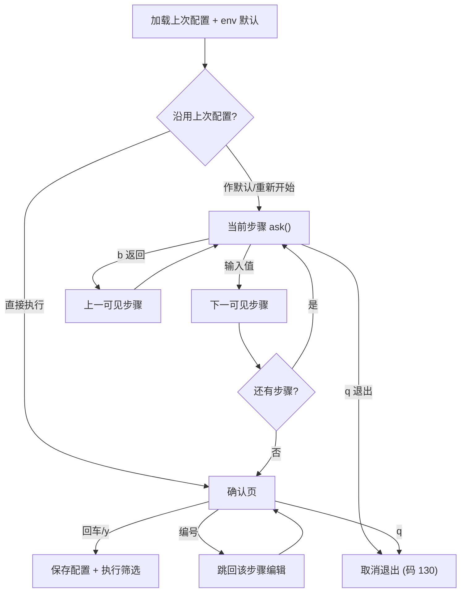

# 交互式筛选脚本命令行交互优化设计

- 日期: 2026-06-01
- 范围: `stock_screener` 交互式筛选 CLI（`run_screening.sh` 入口 → `interactive_screening.py`）
- 方案: 步骤引擎重构（B） + 记忆上次配置

## 1. 背景

`run_screening.sh` 仅是启动包装器：加载 `.env`、设置 `RUNTIME_HOME`/`HOME`、定位 venv，无参数且为 TTY 时 `exec` 进入 `interactive_screening.py`；否则按 env 组装 `scheduled_daily_job.py` 参数的非交互路径。

真正的命令行交互集中在 `interactive_screening.py` 的 `ScreeningInteractiveApp.prompt_options`：一段写死的线性提问序列（约 10+ 问），配套 `_prompt_*` 助手。

### 1.1 现存问题

1. 流程纠错：线性顺序提问，中途答错只能 `Ctrl+C` 重来；无"返回上一步"。
2. 无执行前确认：答完直接开跑，没有 review/中止机会。
3. `Ctrl+C` 未捕获，抛 Python traceback，配合 `set -euo pipefail` 体验差；无 `q/quit` 优雅退出。
4. 规则链选择（`_prompt_chain_for_markets`）：无论选中哪些市场都打印 HK/US/A 全部链；只能手敲 `chain_key`，无编号选择且不校验，敲错静默落到下游。
5. 无配置记忆：每次从头答；交互默认值与 `run_screening.sh` 的 env 默认值两套口径（如 timeframe 交互硬编码 `1d`，脚本读 `TIMEFRAME`）。
6. 输入便捷性：市场/股票池只能输代码不能编号多选；help 文本每次重试都重复刷屏；custom 模式股票代码默认填示例股，回车会误筛一只示例股；CSV/Futu 等高级项与常用项混在一串提问中。
7. 测试脱节：`tests/test_interactive_screening.py` 仍假设单个 `options.chain_key` 与"先选链后选市场"的旧顺序，与当前 `chain_by_market` 实现不一致。

## 2. 目标

- 引入数据驱动的步骤引擎，支持返回上一步、执行前确认页、确认页按编号跳转编辑、优雅退出。
- 规则链选择按选中市场过滤、支持编号选择并校验。
- 记忆上次配置，支持一键复用或作为默认值。
- 统一交互默认值与 env 默认值口径。
- 精简 help 刷屏、支持市场/池编号多选、修正 custom 代码默认值。
- 修正脱节的测试。

## 3. 非目标（Future Work）

- 命名预设 profile 与 `--profile` 非交互运行。
- 改动 `run_screening.sh` 的非交互/`--mode` 直达路径。
- 改动下游 `run_full_market_screening` / `run_custom_code_screening` 执行逻辑、DB schema、规则引擎。

## 4. 架构：步骤引擎

将"一问一答"抽象为步骤列表 + 驱动循环，取代 `prompt_options` 中写死的线性顺序。

### 4.1 Step

每个 `Step` 包含：

- `key`: 标识（如 `timeframe`）
- `title`: 中文标题
- `visible(answers) -> bool`: 条件可见
- `ask(answers, default) -> value`: 复用现有 `_prompt_*` 助手返回取值
- `render_label(value) -> str`: 值 → 中文短语，供确认页只读展示
- `advanced: bool`: 是否归入高级项（默认折叠）

取值统一写入 `answers: Dict[str, Any]`，流程结束后映射为 `InteractiveScreeningOptions`。

条件可见示例：

- `require_fresh_pools` 仅当 `fetch_pools is True`
- `markets/pools/fetch_pools/market_workers/futu_host/futu_port` 仅 full 模式
- `market/codes` 仅 custom 模式
- 高级项（`csv_path/futu_host/futu_port`）仅当用户选择展开高级设置

### 4.2 PromptFlow 驱动器

维护"可见步骤"的有序游标，逐步 `ask`。识别特殊输入：

- `b` / 返回 → 回到上一个可见步骤
- `q` / 退出 → 取消，返回非零退出码

走完最后一步进入确认页。驱动器注入 `input_func`/`print_func`，不依赖 DB/网络，可纯单测。



## 5. 确认页与纠错

执行前展示配置确认页，按编号列出最终配置：

```
━━━ 配置确认 ━━━
  1. 运行模式      全市场筛选
  2. K线周期       1d
  3. 搜索+模型分析  已启用
  4. 主力资金外部   已启用
  5. 飞书通知       否
  6. 筛选市场       HK, US, A
  7. 股票池         best, major_index, all_etf
  8. 刷新股票池     是
  9. 市场并发       3
 10. 各市场规则链   HK→(默认) / US→us_trial / A→(默认)
 [高级] CSV 路径 / Futu host:port

回车=开始执行 | 输入编号=修改该项 | b=返回上一步 | q=退出
```

- 输入编号 → 跳回对应步骤重作答，答完回到确认页（不重走后续步骤）。
- 高级项默认折叠为一行摘要，编辑时进入对应步骤。
- `Ctrl+C` 全程捕获：打印"已取消"，返回退出码 130，不抛 traceback。
- 确认页只读展示复用各步骤 `render_label`，与 `run_full_market_screening` 开头的打印逻辑共用同一套格式化，避免两处口径不一致。

## 6. 规则链选择

按选中市场过滤 + 编号选择 + 校验，替换现有"打印全部市场 + 手敲 chain_key"。

对每个选中市场：

```
━━━ 港股 (HK) 规则链选择 ━━━
  0. (默认链 HK_default_zuoyi_and_other)
  1. ✅ HK_default_zuoyi_and_other  左一战法+其他
        执行路径: ├─ 全部满足 (AND): ...
  2. ⛔ HK_trial_macro              宏观试跑链
请选择 [0]（输入编号；也可直接输入 chain_key；回车=默认链）:
```

- 只列该市场的链（含 `通用/*` 链合并）。
- 支持编号选择，兼容直接输入 `chain_key`（向后兼容）。
- 校验：编号/`chain_key` 必须在该市场列表内，否则提示重输；`0`/回车 = 默认链（存 `None`）。
- DB 读不到链时降级：提示并允许回车走默认链（与现状一致）。
- 数据结构沿用 `chain_by_market: Dict[str, Optional[str]]`（`None`=默认链），下游不改。

规则链选择是步骤引擎中的一个复合步骤，确认页对应项展示其汇总。

## 7. 记忆上次配置

### 7.1 存储

- 路径解析: `os.environ.get("RUNTIME_HOME") or os.path.expanduser("~")` 下的 `interactive_screening_last.json`。注意 `run_screening.sh` 只 `export HOME="$RUNTIME_HOME"` 而未导出 `RUNTIME_HOME` 本身，因此 Python 侧以 `HOME`（=`.runtime_home/`）兜底即可命中同一目录；随项目、不污染用户真实家目录。
- 格式: `{"version": 1, "saved_at": "<ISO8601>", "answers": {...}}`；`answers` 即步骤引擎 dict，均为可 JSON 序列化的基础类型。
- `version` 用于字段演进；读到不兼容版本则忽略并按默认走，不报错。
- 读写失败一律降级，不影响主流程。
- 保存时机: 确认页确认执行后保存（执行成功与否不阻塞保存，以"用户确认的配置"为准）。

### 7.2 启动时

```
检测到上次配置（HK,US,A | 1d | 刷新池 | ...）
  1. 沿用上次配置直接执行
  2. 以上次配置为默认值，逐步确认/修改  默认
  3. 全部用系统默认重新开始
请选择 [2]:
```

- 选 1 → 直接进确认页（仍可改/可取消）。
- 选 2 → 正常走步骤引擎，每步默认值 = 上次值。
- 选 3 → 忽略上次配置。
- 无上次配置文件时跳过此选择，直接进入步骤引擎。

### 7.3 默认值优先级

每个步骤的 default 来源优先级：`上次配置值 > 环境变量 > 内置默认`。

理由：交互场景下"上次的选择"最贴近用户意图；env 主要服务 `run_screening.sh` 的非交互路径。

## 8. 文件结构

- `interactive_screening.py`（保留）: `ScreeningInteractiveApp`、`run`、`run_full_market_screening`、`run_custom_code_screening`、现有 `_prompt_*` 助手。`prompt_options` 改为"构建步骤列表 → 交给驱动器 → 映射成 `InteractiveScreeningOptions`"。
- `screening_prompt_flow.py`（新增）: `Step` 数据类、`PromptFlow` 驱动器（前进 / `b` 返回 / `q` 退出 / 确认页 / 编号编辑）、确认页渲染。纯逻辑，注入 `input_func`/`print_func`，不依赖 DB/网络。
- `screening_config_store.py`（新增）: `load_last_config()` / `save_last_config(answers)`，含 `version` 校验与异常降级。
- `screening_defaults.py`（新增，或并入 prompt_flow）: 集中 env → 默认值映射（`TIMEFRAME / MARKETS / POOLS / CSV_PATH / MARKET_WORKERS / FUTU_HOST / FUTU_PORT / NO_FETCH / NO_FEISHU / REQUIRE_FRESH_POOLS / ENABLE_LLM_ANALYSIS / MAIN_FORCE_ENABLE_EXTERNAL_DATA`），实现"上次 > env > 内置"优先级。

## 9. 附带修整

- 修正脱节的 `tests/test_interactive_screening.py`（单 `chain_key`、旧顺序）。
- help 文本仅在步骤首次展示时打印一次，重试不再重复刷屏。
- 市场/股票池支持编号多选，兼容原有代码输入。
- custom 模式股票代码去掉"默认填示例股"，改为必填（回车不再误筛示例股）。

## 10. 测试

沿用注入 `input_func`/`print_func` 的现有风格，纯单测、不连 DB/网络。

- 驱动器: 前进到底、`b` 多步返回、`q` 取消、确认页"编号编辑后回到确认页"。
- 条件可见: full/custom 各自步骤集合正确；`require_fresh_pools` 仅在刷新池时出现；高级项折叠。
- 规则链: 按市场过滤、编号选择、非法编号/key 重试、DB 失败降级、`None`=默认。
- config_store: round-trip、version 不兼容忽略、读写异常降级。
- 默认值优先级: 上次 > env > 内置。
- 回归: `prompt_options` 产出的 `InteractiveScreeningOptions` 字段与下游 `run_*` 兼容。

## 11. 兼容性

- `InteractiveScreeningOptions` 字段保持兼容（含 `chain_by_market`），下游 `run_full_market_screening` / `run_custom_code_screening` 不改。
- `run_screening.sh` 的 `--mode` 直达与非交互路径不变。
- 新增配置文件为可选增强，缺失/损坏时行为回退到"无记忆"。
